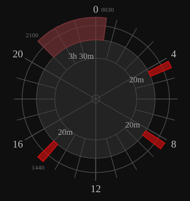

# Welcome to napchart

Napchart is an online visualization tool for creating polyphasic sleep schedules. It lets you design your sleep patterns by creating sleep blocks and dragging them around. Hopefully, this tool will help making polyphasic sleep easier to experiement with, and contribute to more research on the subject.

## How to install

To install napchart you will need the following:

* Node.js
* npm
* Optional: MySQL server

1. Run `npm install` from the command line in the napchart directory
2. Start the server `node script`

You should now be able to access napchart from `localhost:3000`

### MySQL Configuration

If you want to enable chart saving, you will need to set up your MySQL configuration

1. Run `node script --setup` and enter your credentials. They will be saved in `config.json` in the project root, so you can edit this manually if you like.
2. Run `node script --create-tables` to create tables. If you want to, you can choose to delete existing tables first.

Chart saving should now be enabled and will show up on the site.

## Planned features

* Preserve settings when revisiting site
* Add text/description to elements on the chart
* Add title and description to chart
* Interactive animated tour to show you what polyphasic sleep is
* For bugs see *issues*

## Understanding the code

Napchart is written with javascript modules. All modules are stored in the `public/js` folder.

Modules have this structure:

```
/**

This module handles something

**/

window.module=(function(){
	//private
	var h = 'hello';

	//public:
	return{
		hello:function(){
			console.log(h);
		}
	}

}());
```

### Data structure
```
var data = {
nap:[],
core:[{start:1410,end:480}],
busy:[]
}
```
You can find this object structure all over the project. It defines a *chart*.

They are iterated like this:
```
for (var name in data){
	for (var i; i < data[name].length; i++){
		console.log(data[name][i].start);
	}
}
```

`element` = a elment like `{start:1410,end:480}`

`name` = nap, core or busy arrays containing elements

`count` = the index of the element in the array

### Modules

#### application.js

When the document is ready, this module will start the app. It will supply data from the fromServer object if it is there.

#### napchartCore.js

NapchartCore is the core module. This is the _one module to rule them all_. From here, all modules get initialized. Most of the communication between modules goes through this module.
The data object containing info about the present schedule is stored here in `scheduleData`.

#### draw.js

This module draws the chart to canvas.

#### interactCanvas.js

Makes the canvas created by `draw` clickable and touchable. With this module you can modify elements and move them around in an intuitive way.

#### formInput.js

As an alternative to modify your chart with `interactCanvas` , you can use this module with simple dom input elements. Creates input elements in a specified container.

#### settings.js

Gets values from a `div` with checkboxes or input elements. Other modules can call `settings.getValue(id)` to get a value.

### barHandler.js

When you add an element, this module makes sure the element is placed on a place on the chart that is not so full. It will also make sure the element is a reasonable length. Rules stored in `barAddRules`

#### helpers.js

This module has some handy functions to make common calculations easier.
Some of the most used are:

`helpers.calc(minutes, plus)` - Takes the first argument and adds it with the other. Then it makes sure the numer is more than 0 and less than 1439. (because there are 1440 minutes in 24 hours)

`helpers.minutesToXY(minutes, radius, basewidth, baseheight)` - Gives you x and y values of a point on canvas.  `basewidth` and `baseheight` can be used to move origo to center. Example: `helpers.minutesToXY(720, 20, canvas.width/2, canvas.height/2)`

#### history.js

Handles history. When other modules `history.add()` a current state, the user can jump back and forth using back and forward buttons.

#### sampleSchedules.js

Handles some preset schedules. It also handles schedule detection, and will highlight the schedule that you are on. (If you have one core, monophasic will hightlight. If you have two cores, segmented will highlight, etc)

#### server.js

Handles server interactions to save schedules with ajax.

#### statistics.js

Takes the a schedule object and makes neat little facts about it. It can give you the total time slept, the total time free and possibly more.

#### textSerialize.js

In a way, this is an alternative to `draw`. It makes the schedule easy to read in a text format.
If you save the chart it will put a link in the bottom.
The text created should make it easy for people to share their schedules with others on forums or other places.

#### animate.js

Right now the animate module only does one function, `frameAnimator`. It makes the the indicators fade in when you click an element

#### dom.js

This module handles some of the dom handling. Some modules use the functions here, other use their own functions for dom handling. Ideally, all dom handling should be done here (?)

#### feedback.js

Handles the functionality of the feedback form. Handles DOM by itself

## Example Output

Everyman


